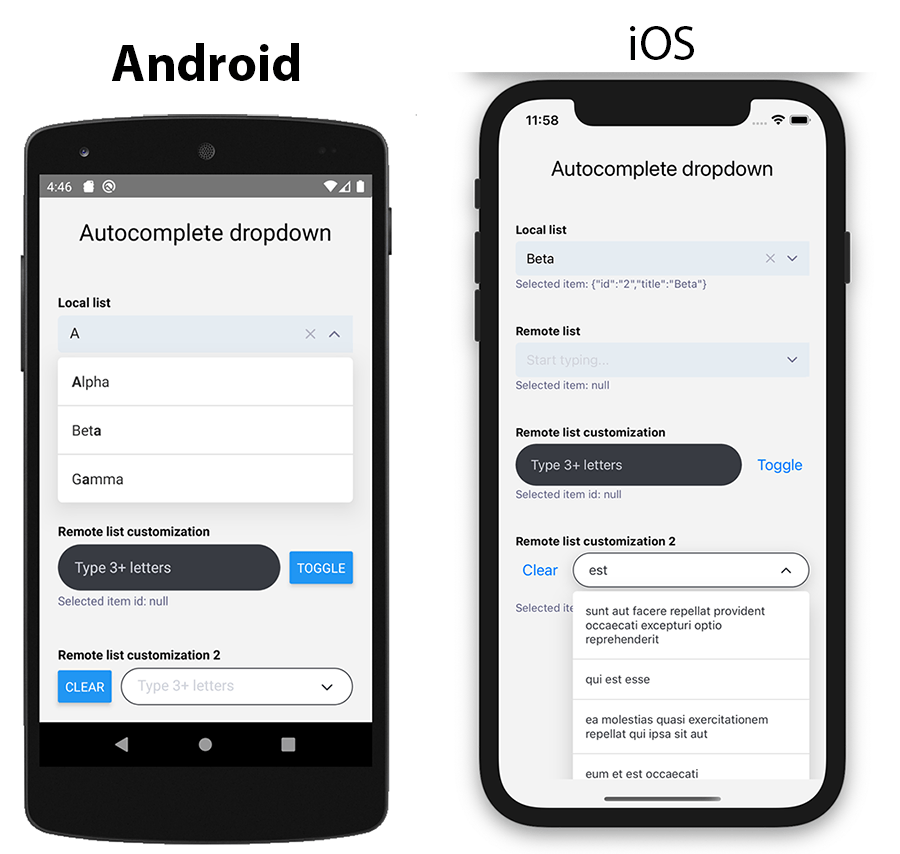
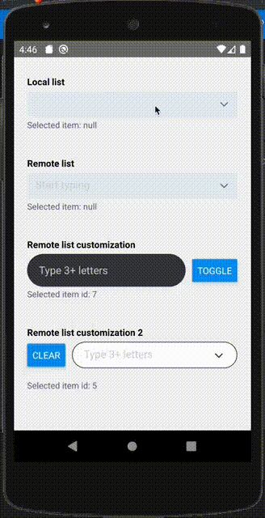
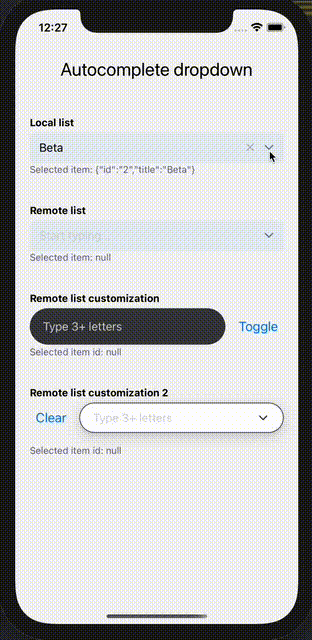

# react-native-autocomplete-dropdown

Dropdown Item picker with search and autocomplete (typeahead) functionality for react native

[](https://img.shields.io/github/license/onmotion/react-native-autocomplete-dropdown)
[](https://npmjs.com/package/react-native-autocomplete-dropdown)
[](https://npmjs.com/package/react-native-autocomplete-dropdown)

<p style="text-align: center;" align="center">
    
</p>

## Demo

<p style="text-align: center;" align="center">
    
    
</p>

> Run expo snack demo [@onmotion/react-native-autocomplete-dropdown](https://snack.expo.io/@onmotion/react-native-autocomplete-dropdown)


## Nav

- [Installation](#installation)
- [Post-install Steps](#post-install-steps)
  - [iOS](#ios)
  - [Android](#android)
- [Usage](#usage)
  - [Example with local Dataset](#example-with-local-dataset)
  - [Example with remote requested Dataset](#example-with-remote-requested-dataset)
- [Options](#options)

## Installation

Run: `npm install --save react-native-autocomplete-dropdown` or `yarn add react-native-autocomplete-dropdown`

## Post-install Steps

Make sure **react-native-vector-icons** is installed. Follow the guides
https://github.com/oblador/react-native-vector-icons

`yarn add react-native-vector-icons`

### iOS

Run: `npx pod-install` for install react-native-vector-icons dependency (if not installed yet).

### Android

Follow the guides from https://github.com/oblador/react-native-vector-icons#android for install react-native-vector-icons dependency (if not installed yet).

## Usage

import the package

```js
import { AutocompleteDropdown } from 'react-native-autocomplete-dropdown'
```

### Dataset item format

`dataSet` property must be an **array of objects** or **null**. Object required keys are:

```js
{
    id: 'some uniq string id',
    title: 'list item title'
}
```

### Example with local Dataset

```js
const [selectedItem, setSelectedItem] = useState(null)

;<AutocompleteDropdown
  clearOnFocus={false}
  closeOnBlur={true}
  closeOnSubmit={false}
  initialValue={{ id: '2' }} // or just '2'
  onSelectItem={setSelectedItem}
  dataSet={[
    { id: '1', title: 'Alpha' },
    { id: '2', title: 'Beta' },
    { id: '3', title: 'Gamma' },
  ]}
/>
```

### Example with remote requested Dataset

```js
    const [loading, setLoading] = useState(false)
    const [suggestionsList, setSuggestionsList] = useState(null)
    const [selectedItem, setSelectedItem] = useState(null)
    const dropdownController = useRef(null)
    const searchRef = useRef(null)

    const getSuggestions = useCallback(async (q) => {
        if (typeof q !== "string" || q.length < 3) {
            setSuggestionsList(null)
            return
        }
        setLoading(true)
        const response = await fetch("https://jsonplaceholder.typicode.com/posts")
        const items = await response.json()
        const suggestions = items.map((item) => ({
            id: item.id,
            title: item.title
        }))
        setSuggestionsList(suggestions)
        setLoading(false)
    }, [])

    <AutocompleteDropdown
          ref={searchRef}
          controller={(controller) => {
            dropdownController.current = controller
          }}
          dataSet={suggestionsList}
          onChangeText={getSuggestions}
          onSelectItem={(item) => {
            item && setSelectedItem(item.id)
          }}
          debounce={600}
          suggestionsListMaxHeight={Dimensions.get("window").height * 0.4}
         // onClear={onClearPress}
          //  onSubmit={(e) => onSubmitSearch(e.nativeEvent.text)}
         // onOpenSuggestionsList={onOpenSuggestionsList}
          loading={loading}
          useFilter={false} // prevent rerender twice
          textInputProps={{
            placeholder: "Type 3+ letters",
            autoCorrect: false,
            autoCapitalize: "none",
            style: {
              borderRadius: 25,
              backgroundColor: "#383b42",
              color: "#fff",
              paddingLeft: 18
            }
          }}
          rightButtonsContainerStyle={{
            borderRadius: 25,
            right: 8,
            height: 30,
            top: 10,
            alignSelfs: "center",
            backgroundColor: "#383b42"
          }}
          inputContainerStyle={{
            backgroundColor: "transparent"
          }}
          suggestionsListContainerStyle={{
            backgroundColor: "#383b42"
          }}
          containerStyle={{ flexGrow: 1, flexShrink: 1 }}
          renderItem={(item, text) => (
            <Text style={{ color: "#fff", padding: 15 }}>{item.title}</Text>
          )}
          ChevronIconComponent={
            <Feather name="x-circle" size={18} color="#fff" />
          }
          ClearIconComponent={
            <Feather name="chevron-down" size={20} color="#fff" />
          }
          inputHeight={50}
          showChevron={false}
          //  showClear={false}
        />
```

More examples see at https://github.com/onmotion/react-native-autocomplete-dropdown/tree/main/example

Run

```bash
cd example
yarn install
yarn add react-native-vector-icons
npx pod-install
npm run ios

```

## Options

| Option                          | Description                                                                       | Type                 | Default                                     |
| ------------------------------- | --------------------------------------------------------------------------------- | -------------------- | ------------------------------------------- |
| `dataSet`                       | set of list items                                                                 | array                | null                                        |
| `initialValue`                  | string (**id**) or object that contain **id**                                     | string \| object     | null                                        |
| `loading`                       | loading state                                                                     | bool                 | false                                       |
| `useFilter`                     | whether use local filter by dataSet (useful set to false for remote filtering)    | bool                 | true                                        |
| `showClear`                     | show clear button                                                                 | bool                 | true                                        |
| `showChevron`                   | show chevron (open/close) button                                                  | bool                 | true                                        |
| `closeOnBlur`                   | whether to close dropdown on blur                                                 | bool                 | false                                       |
| `closeOnSubmit`                 | whether to close dropdown on submit                                               | bool                 | false                                       |
| `clearOnFocus`                  | whether to clear typed text on focus                                              | bool                 | true                                        |
| `debounce`                      | wait **ms** before call `onChangeText`                                            | number               | 0                                           |
| `suggestionsListMaxHeight`      | max height of dropdown                                                            | number               | 200                                         |
| `bottomOffset`                  | for calculate dropdown direction (e.g. tabbar)                                    | number               | 0                                           |
| `onChangeText`                  | event textInput onChangeText                                                      | function             |                                             |
| `onSelectItem`                  | event onSelectItem                                                                | function             |                                             |
| `onOpenSuggestionsList`         | event onOpenSuggestionsList                                                       | function             |                                             |
| `onClear`                       | event on clear button press                                                       | function             |                                             |
| `onSubmit`                      | event on submit KB button press                                                   | function             |                                             |
| `onBlur`                        | event fired on text input blur                                                    | function             |                                             |
| `onFocus`                       | event on focus text input                                                         | function             |                                             |
| `controller`                    | return reference to module controller with methods **close, open, toggle, clear, setInputText, setItem** | function             |                                             |
| `containerStyle`                |                                                                                   | object               |                                             |
| `rightButtonsContainerStyle`    |                                                                                   | object               |                                             |
| `suggestionsListContainerStyle` |                                                                                   | object               |                                             |
| `ChevronIconComponent`          |                                                                                   | React.Component      | Feather chevron icon                        |
| `ClearIconComponent`            |                                                                                   | React.Component      | Feather x icon                              |
| `ScrollViewComponent`           |                                                                                   | React.Component name | ScrollView that provide suggestions content |
| `emptyResultText`               | replace the default "Nothing found" text on empty result                          | string               | "Nothing found"                             |
